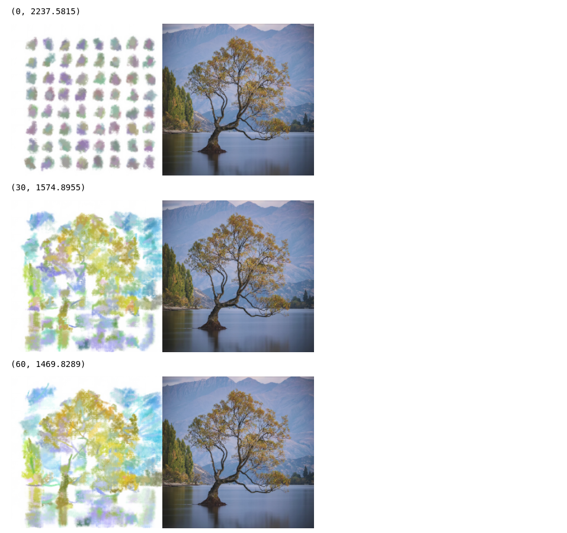

# Neural Painters

Playing around with [reiinakano/neural-painters](https://github.com/reiinakano/neural-painters)

## Setup

### Get Pretrained Model

```bash
./data_get.sh get
```

### Setup Environment

#### Conda

```bash
conda env create -f environment.yml
conda activate neural-painters
```

### Run Notebook

```bash
ipython notebook ./notebook.ipynb
```



## Attribution

- [reiinakano/neural-painters](https://github.com/reiinakano/neural-painters)